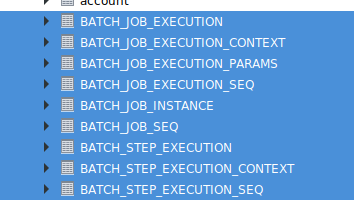
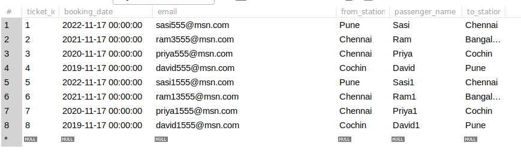

# springboot-batch-dbtocsv-demo
This project explains how to insert data from database to csv file using springbatch through springboot

### What is Springbatch?
Spring Batch is part of Spring Framework.
* Its a Java based framework for batch processing.
* A lightweight, comprehensive batch framework.
* POJO-based development approach, known from the Spring Framework.

Based on principles and advantages of Spring Framework.
• It supports:
	– Concurrent batch processing.
	– Massively parallel batch processing.
	– Manual or scheduled restart after failure.
	– Commit batch periodically.
	– Other features.
	
What is Batch Processing?
• The batch processing is used for batch applications to process high volume of data.
• Usually a batch application:
	– Reads a high amount of data from several sources (DB, CSV/XML files,queues, web services, others).
	– Process or transforms the data read following certain business rules.
	– Writes the transformed data in one or more destinations.
• Usually batch applications are crucial for businesses because of:
    – The amount of data they handle.
    – The processing times of the data.
• They follow the ETL principle in datawarehousing / datamining.

### Springbatch Concepts:

_**Job**_
• It is the most important concept in Spring Batch.
• It needs a JobLauncher instance to be executed.
• It can contain one or more steps, which can be executed in sequence or parallel.

**_Step_**
• It encapsulates an independent and sequential phase of a job.
• It contains exactly a Reader, a Writer and optionally a Processor.

**_Reader_**
• It represents an abstraction which is responsible for recovering
data from a source.
• When it can not retrieve more data, it returns null.

**_Writer_**
• It represents the output for a step in chunk oriented processing.
• There are various implementations out-of-the-box.
• It has not any knowledge about the reader implementation.

**_Processor_**
• It is optional in the chunk oriented processing.
• It represents the business process for each item, and it can
return a null, when that item doesn’t need to be written.

**_Listeners_**
* Bring us the possibility to perform some actions during the execution of a Job and/or Step.
* There are some types of listeners:
    • StepExecutionListener
    • ChunkListener
    • ItemReadListener
    • ItemProcessListener
    • ItemWriteListener
    • SkipListener
    
Spring Batch Framework offers ‘TaskletStep Oriented’ and ‘Chunk Oriented’ processing style.

**_TaskletStep_**
Tasklet is an interface, which will be called to perform a single task only, like clean or set up resources before or after any step execution.

**_Chunk Oriented_**

Chunk Oriented Processing Feature has come with Spring Batch v2.0. 
It refers to reading the data one at a time, and creating ‘chunks’ that will be written out, within a transaction boundary. One item is read from an ItemReader, handed to an ItemProcessor, and written. Once the number of items read equals the commit interval, the entire chunk is written out via the ItemWriter, and then the transaction is committed.
Basically, this feature should be used if at least one data item’ s reading and writing is required. Otherwise, TaskletStep Oriented processing can be used if the data item’ s only reading or writing is required.
Chunk Oriented Processing model exposes three important interface as ItemReader, ItemProcessor and ItemWriter via org.springframework.batch.item package.

### Implemented Spring batch using Springboot

### Maven dependencies

```
<dependency>
	<groupId>org.springframework.boot</groupId>
	<artifactId>spring-boot-starter-batch</artifactId>
</dependency>
<dependency>
	<groupId>org.springframework.batch</groupId>
	<artifactId>spring-batch-test</artifactId>
	<scope>test</scope>
</dependency>

```
### application.properties
```
spring.datasource.url=jdbc:mysql://localhost:3306/techjava
spring.datasource.username=root
spring.datasource.password=root
spring.jpa.hibernate.ddl-auto=update
spring.jpa.show-sql=true
server.port=8085

```
**_Step 1:_** Created Ticket pojo classes

```
@Data
@AllArgsConstructor
@NoArgsConstructor
@ToString
public class Ticket {

    private Integer ticketId;

    private String passengerName;

    private String fromStation;

    private String toStation;

    private String email;

    private Date bookingDate;
}
```

**_Step 2:_** Created BatchConfig class to configure the batchjob

```
@Configuration
@EnableBatchProcessing
@Slf4j
public class TicketBatchConfig {

    @Autowired
    private JobBuilderFactory jobBuilderFactory;

    @Autowired
    private StepBuilderFactory stepBuilderFactory;

    @Autowired
    private TicketReader ticketReader;

    @Autowired
    private TicketWriter ticketWriter;


    @Bean
    public JdbcCursorItemReader<Ticket> itemReader(){
        return ticketReader.reader();
    }

    @Bean
    public FlatFileItemWriter<Ticket> itemWriter(){
        return ticketWriter.fileItemWriter();
    }

    @Bean
    public TicketProcessor getTicketProcessor(){
        return new TicketProcessor();
    }

    @Bean
    public Job exportTicketJob(){
        return jobBuilderFactory.get("exportTicketJob").incrementer(new RunIdIncrementer()).flow(step1()).end().build();
    }

    @Bean
    public Step step1() {
        return stepBuilderFactory.get("step1")
                .<Ticket,Ticket>chunk(4)
                .reader(itemReader())
                .processor(getTicketProcessor())
                .writer(itemWriter())
                .build();

    }

}

```
**_Step 3:_** Created TicketReader class which will read the Ticket details from the database. Here I have used JdbcCursorItemReader to read the data.

```
@Component
public class TicketReader {

    @Autowired
    public DataSource dataSource;

    private static final String SQL = "select ticket_id,booking_date,email,from_station,passenger_name,to_station from ticket";

    @Bean
    public JdbcCursorItemReader<Ticket> reader() {
        JdbcCursorItemReader<Ticket> cursorItemReader = new JdbcCursorItemReader<>();
        cursorItemReader.setDataSource(dataSource);
        cursorItemReader.setSql(SQL);
        cursorItemReader.setRowMapper(new TicketRowMapper());
        return cursorItemReader;
    }
}

```

Step 4: Created TicketProcessor class which will transfer one object to another object. We can also do other busniess logic here.

```
@Slf4j
public class TicketProcessor implements ItemProcessor<Ticket, Ticket> {
    @Override
    public Ticket process(Ticket ticket) throws Exception {
        Integer ticketId = ticket.getTicketId();
        String passengerName = ticket. getPassengerName();
        String fromStation = ticket.getFromStation();
        String toStation = ticket.getToStation();
        String email = ticket.getEmail();
        Date bookingDate = ticket.getBookingDate();

        Ticket ticket1 = new Ticket(ticketId,passengerName, fromStation, toStation, email, bookingDate);
        return ticket1;
    }
}

```

Step 5: Created TicketWriter class which will write the Ticket data information into csv file.

```
@Component
public class TicketWriter {

    @Bean
    public FlatFileItemWriter<Ticket> fileItemWriter(){
        FlatFileItemWriter<Ticket> itemWriter = new FlatFileItemWriter<>();
        itemWriter.setResource(new ClassPathResource("ticket2.csv"));

        DelimitedLineAggregator<Ticket> ticketDelimitedLineAggregator = new DelimitedLineAggregator<>();
        ticketDelimitedLineAggregator.setDelimiter(",");

        BeanWrapperFieldExtractor<Ticket> wrapperFieldExtractor = new BeanWrapperFieldExtractor<>();
        wrapperFieldExtractor.setNames(new String[] {"ticketId","bookingDate", "email", "fromStation", "passengerName", "toStation"});
        ticketDelimitedLineAggregator.setFieldExtractor(wrapperFieldExtractor);

        itemWriter.setLineAggregator(ticketDelimitedLineAggregator);
        return itemWriter;
    }
}

```

### Screenshots




